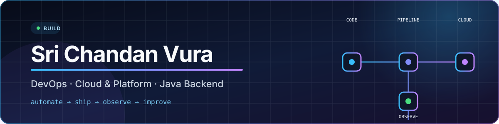

<div align="center">
  

  <br />

  <a href="https://chandanvura.github.io/Portfolio_chandan/"><strong>Portfolio</strong></a>
  ·
  <a href="https://github.com/chandanvura?tab=repositories"><strong>Projects</strong></a>
  ·
  <a href="https://jobradar.chandanvura.workers.dev"><strong>JobRadar</strong></a>

  <br />
  <br />

  <strong>DevOps Engineer · Cloud &amp; Platform Engineering · Java Backend</strong>
  <br />
  Building reliable delivery pipelines, cloud-native platforms, and practical developer tools.
</div>

## About me

- DevOps and backend engineer focused on automation, dependable delivery, and production-minded systems.
- Hands-on with **AWS, Kubernetes, Docker, Terraform, Jenkins, GitHub Actions, Argo CD, and Linux**.
- Backend experience with **Java, Spring Boot, REST APIs, microservices, Maven, and Python**.
- I like turning repetitive work into pipelines and complex engineering ideas into useful, approachable products.
- Open to **DevOps, Platform, SRE, Cloud, and Java Backend** opportunities.

## Tech stack

**Cloud, containers & infrastructure**

`AWS` · `Kubernetes` · `Docker` · `Terraform` · `Ansible` · `Helm` · `Linux`

**CI/CD, GitOps & quality**

`Jenkins` · `GitHub Actions` · `Argo CD` · `Git` · `SonarQube`

**Backend, automation & observability**

`Java` · `Spring Boot` · `Python` · `Prometheus` · `Grafana` · `Splunk`

## Featured work

| Project | What it does | Core stack | Explore |
|---|---|---|---|
| **JobRadar** | Production job-discovery system that checks **297 official career sources**, ranks verified 0–3 YOE roles, deduplicates results, and delivers Telegram alerts. | React · TypeScript · Python · Cloudflare Workers · D1 · GitHub Actions | [Live dashboard](https://jobradar.chandanvura.workers.dev) · [Source](https://github.com/chandanvura/JobRadar) |
| **Java Depth Academy** | Fast multi-page learning platform covering Java, Spring Boot, microservices, system design, DSA, and interviews. | Java concepts · HTML · CSS · JavaScript · PWA | [Live app](https://chandanvura.github.io/Java/) · [Source](https://github.com/chandanvura/Java) |
| **DSA Mental Models** | Visual Java DSA learning map built around reusable problem-solving patterns, animations, and interview practice. | Next.js · TypeScript · Tailwind CSS · Static export | [Live app](https://chandanvura.github.io/dsa-mental-models-java/) · [Source](https://github.com/chandanvura/dsa-mental-models-java) |
| **Engineering Portfolio** | Focused portfolio for DevOps, platform, cloud, and Java engineering work. | HTML · CSS · JavaScript · GitHub Pages | [Visit](https://chandanvura.github.io/Portfolio_chandan/) · [Source](https://github.com/chandanvura/Portfolio_chandan) |

## How I approach engineering

```text
Understand the failure mode → automate the repeatable path → ship safely
→ observe real behavior → improve with evidence
```

- **Reliability first:** explicit health checks, retries, failure visibility, and honest status reporting.
- **Automation with guardrails:** CI/CD, infrastructure as code, GitOps, tests, and safe rollbacks.
- **Useful over flashy:** working systems, clear documentation, and measurable outcomes.

## Engineering snapshot

| Focus | Evidence in my public work |
|---|---|
| **Automation** | Scheduled GitHub Actions, Python adapters, CI/CD workflows, deployment checks, retries, and Telegram delivery |
| **Cloud delivery** | Cloudflare Workers and D1, infrastructure-oriented architecture, protected ingestion, and independent deployment |
| **Reliability** | Source-level health reporting, stale-run detection, deduplication, immutable first-seen tracking, and safe failure handling |
| **Developer learning** | Dedicated Java Depth Academy and DSA Mental Models applications with navigable, interview-focused content |

## Let's build something reliable

I’m interested in work around cloud platforms, deployment automation, observability, backend services, and developer productivity.

**[View my portfolio](https://chandanvura.github.io/Portfolio_chandan/)** · **[Explore my projects](https://github.com/chandanvura?tab=repositories)**

<div align="center">
  <sub>Build clearly. Automate thoughtfully. Improve continuously.</sub>
</div>
